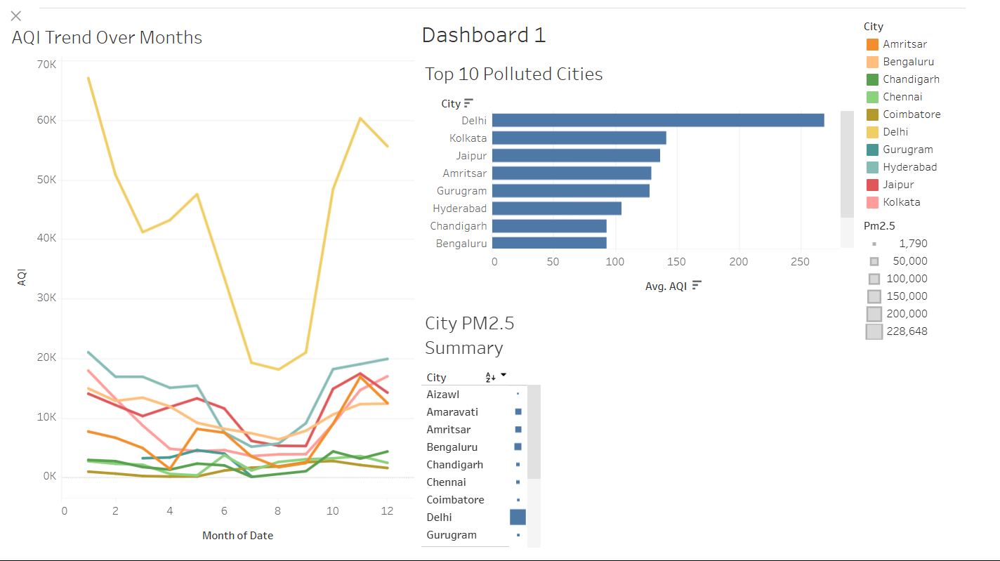

# Air Quality Data Analysis (India, 2015–2020)

**Author:** Vishal Kumar  
**Tools Used:** Python (pandas, matplotlib, seaborn), Tableau Public

---

## Overview

This project presents a comprehensive analysis of air quality trends in major Indian cities from 2015 to 2020 using a real-world Kaggle dataset.  
The workflow covers data cleaning, exploratory data analysis (EDA), insightful visualizations, and an interactive Tableau dashboard.

---

## Project Workflow

1. **Data Collection**
    - Source: [Kaggle – Air Quality Data in India](https://www.kaggle.com/rohanrao/air-quality-data-in-india)
2. **Data Cleaning (Jupyter Notebook)**
    - Handled missing values, dropped incomplete columns/rows, and exported a cleaned dataset.
3. **Exploratory Data Analysis (EDA)**
    - Analyzed AQI and pollutant trends (PM2.5, PM10, NO2, etc.)
    - Visualized seasonality, city comparisons, and pollutant correlations.
4. **Data Visualization (Tableau)**
    - Built an interactive dashboard for time series, city-wise analysis, and heatmaps.
    - **Dashboard preview:**  
      

---

## Project Structure

air-quality-analysis-india/
│
├── 01_Data_Cleaning_and_EDA.ipynb # Jupyter Notebook for cleaning & EDA
├── cleaned_air_quality.csv # Cleaned dataset
├── Dashboard.png # Tableau dashboard screenshot
└── README.md # Project description and findings

---

## Getting Started

- **Notebook:** Open `01_Data_Cleaning_and_EDA.ipynb` for all Python code and analysis.
- **Data:** Use `cleaned_air_quality.csv` in Tableau, Excel, or Power BI.
- **Dashboard:**  
  See the screenshot above, or [add your Tableau Public link here if published].

---

## Key Insights & Recommendations

- **Delhi** and **Kolkata** show the highest average AQI among all cities.
- AQI levels peak in **winter months** (Nov–Jan), indicating strong seasonality.
- **PM2.5** is the strongest correlate with AQI, suggesting a targeted policy focus.
- Efforts to reduce **PM2.5 and PM10** can have the greatest positive impact on urban air quality.

---

## Credits

- **Dataset:** [Rohan Rao / Kaggle](https://www.kaggle.com/rohanrao/air-quality-data-in-india)
- **Analysis & Visualization:** Vishal Kumar

---

## Contact

For questions, feel free to connect via www.linkedin.com/in/vishalkumar4007.

